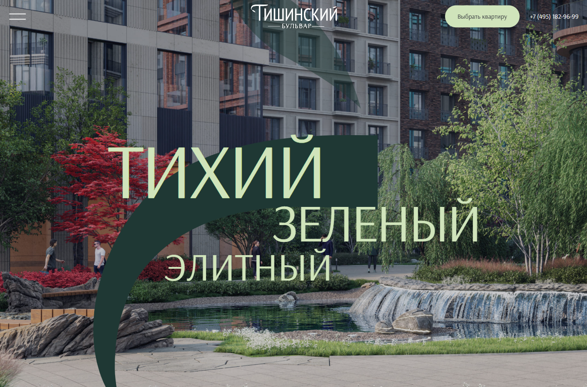

# Sminex-Inteko-Tishinsky-Boulevard-Pre-release-Audit

Frontend optimization and quality assurance project for the "Tishinsky Boulevard" real estate website. Conducted a comprehensive audit to resolve accumulated issues and prepare the site for launch, focusing on performance, accessibility, and code quality.

## 🚀 Live Demo
**[View the live website here](https://kseniiasad.github.io/Sminex-Inteko-Tishinsky-Boulevard-Pre-release-Audit/)**

## 📸 Preview

## 📋 Project Overview
This project involved a **detailed pre-release audit** based on feedback from the development team and QA. The goal was to address frontend issues across multiple categories to ensure a polished, production-ready user experience that meets modern web standards.

## 🛠️ Technologies & Approach
- **HTML5** (Semantic markup, validation)
- **CSS3 & Sass** (BEM methodology, maintainable styles)
- **Responsive Layout** (Fluid design for 360px to 4000px viewports)
- **Tooling:** Figma, Chrome DevTools (Lighthouse, Console), Git
- **Focus Areas:** Performance, Accessibility (a11y), Cross-browser Compatibility, Visual Fidelity

## 🔧 Key Improvements Delivered
### **Performance & Core Metrics**
- Optimized Lighthouse scores across all categories (Performance, Accessibility, Best Practices, SEO).
- Implemented image optimization strategies and proper resource loading.

### **Code Quality & Semantics**
- Restructured HTML for better semantics and validation compliance.
- Refactored CSS for improved maintainability and specificity.
- Ensured consistent container behavior and spacing.

### **User Experience & Accessibility**
- Enhanced interactive elements with proper states and keyboard navigation.
- Improved form usability and validation feedback.
- Increased touch target sizes for mobile interfaces.

### **Visual Consistency & Responsive Behavior**
- Applied precise design alignment (Pixel Perfect).
- Fixed responsive issues across all target devices.
- Ensured consistent image behavior and full‑bleed sections.

## 📁 Project Structure
Sminex-Inteko-Tishinsky-Boulevard-Pre-release-Audit/
├── index.html
├── site.webmanifest
├── scss/
│ └── blocks/
│ └── global/
│ ├── style.scss
├── css/
├── images/
│ ├── advantages/
│ ├── architecture/
│ ├── children-info/
│ ├── elite-promo/
│ ├── hero/
│ ├── respectability/
│ ├── section-next/
│ ├── sprite/
│ ├── unique/
│ ├── sprite.svg
├── favicon/
├── video/
├── fonts/
└── README.md

## ✅ Quality Assurance
- **Validation:** Passed HTML validation and BEM methodology checks.
- **Cross‑browser:** Consistent rendering in modern browsers.
- **Responsive:** Fully functional across the entire specified viewport range.
- **Accessibility:** Improved keyboard and screen reader support.

## 💡 Professional Reflection
This audit reinforced the importance of a systematic approach to frontend quality. Moving beyond feature implementation to focus on performance, accessibility, and maintainability is what transforms a functional site into a polished product ready for users.

## 📬 Contact  
[My GitHub Profile](https://github.com/KseniiaSad)
